<table>
<colgroup>
<col style="width: 21%" />
<col style="width: 78%" />
</colgroup>
<tbody>
<tr>
<td rowspan="2"></td>
<td style="text-align: center;">
<strong>Manuel utilisateur du
plugin</strong>

<strong>« contribution directe (hydro national) »</strong>

<strong>V1.2.1</strong>
</td>
</tr>
<tr>
<td style="text-align: center;"></td>
</tr>
</tbody>
</table>

**Sommaire**

[1 Prérequis](#prérequis)

[2 Résumé](#résumé)

[3 Installation](#installation)

[4 Présentation](#présentation)

[5 Utilisation](#utilisation)

[6 Exemple de manipulation : je veux modifier la nature d’un tronçon](#exemple-de-manipulation-je-veux-modifier-la-nature-dun-tronçon)

# Prérequis

Version de QGIS : 3.28 ou supérieur

Ce plugin fonctionne en parallèle du plugin « IGN Espace collaboratif »
version 4.2.2 minimum.

Le plugin « maitre » doit impérativement être installé.

# Résumé

Ce plugin est une aide à la modification sémantique des tronçons
hydrographique

L’interface permet de changer des valeurs d’attributs d’un ou plusieurs
tronçons hydrographiques des guichets Espace collaboratif « Inventaires
hydrographiques de l’Etat » et « Inventaires hydrographiques de l’Etat –
FORMATION ».

# Installation

Ouvrir QGIS.

Allez dans Extensions/Installer/Gérer les extensions, cliquez sur
Installer depuis un ZIP, sélectionner le fichier ZIP puis cliquez sur
Installer le plugin.

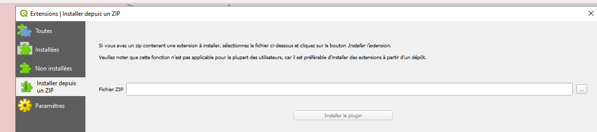

# Présentation

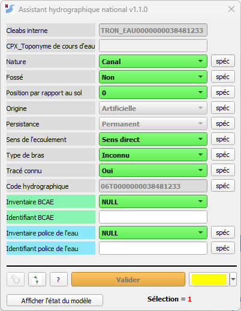

Cette interface permet de modifier certains champs des tronçons
hydrographiques

Lorsque l’on sélectionne un tronçon hydrographique dans QGIS, les
valeurs des attributs du tronçon sont surlignées en vert.

Si plusieurs tronçons sont sélectionnés seules les valeurs communes
apparaissent surlignées en vert. Les valeurs qui diffèrent
n’apparaissent pas.

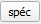 Ce bouton permet d’afficher la
documentation du champs correspondant (https://bdtopoexplorer.ign.fr/)

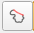 Ce bouton permet de
sélectionner tous les tronçons compris entre 2 tronçons sélectionnés (un
tronçon de départ et un tronçon d’arrivée).

 Affiche le sens de
numérisation des tronçons hydrographiques

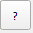 Affiche l’historique des
versions et la documentation de l’outil

 Valide dans QGIS les
modifications saisies dans l’outil

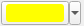 Modifie la couleur de la
sélection

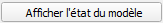

A l’ouverture de l’outil il y a une vérification de la présence dans le
projet des couches nécessaires. Afficher l’état du modèle permet de
**vérifier les permissions sur chaque attribut**. Ces permissions sont
définies dans le projet en fonction des guichets en saisie directe dans
la BDTOPO.

<figure>
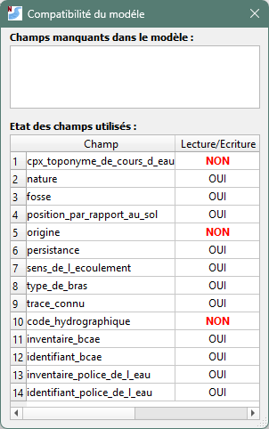
</figure>

# Utilisation

> IMPORTANT : Ce plugin a été développé pour
> être utilisé avec les guichets **Inventaires hydrographiques de
> l’Etat** et **Inventaires hydrographiques de l’Etat – FORMATION.**
>
> Il faut impérativement être connecté à l’espace collaboratif dans un
> des 2 groupes et avoir chargé les couches de ce groupe avant
> l’utilisation du plugin. Il est encore possible de se connecter juste
> après une validation lorsque QGIS le demande si ce n’est pas déjà fait
> sinon les modifications ne seront pas effectives dans l’espace
> collaboratif.
>
> Si on sélectionne un seul tronçon l’interface se met à jour avec les
> valeurs d’attributs correspondant (en vert)
>
> Si on sélectionne plusieurs tronçons, l’interface se met à jour en
> affichant en vert uniquement les valeurs d’attributs qui sont communes
> à tous les tronçons sélectionnés.
>
> Le bouton  style="width:0.35417in;height:0.34375in" /> permet de sélectionner
> tous les tronçons hydro compris entre un tronçon de départ et un
> tronçon d’arrivée (cela facilite la sélection pour de longs cours
> d’eau), cet algorithme détermine le chemin le plus court, il convient
> donc de vérifier que les tronçons sélectionnés correspondent bien à
> ceux que l’on désire modifier.
>
> IMPORTANT : le tronçon de départ et le
> tronçon d’arrivé doivent être visible à l’écran avant de lancer le
> calcul.

# Exemple de manipulation : je veux modifier la nature d’un tronçon

> Je veux modifier la nature d’un tronçon de Ecoulement naturel en Canal

1.  Je sélectionne le tronçon à modifier. Les valeurs de ses attributs
    s’affichent en vert dans l’outil.

> 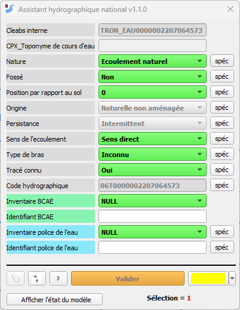 style="width:2.48789in;height:3.21198in" />

2.  Je clique sur la valeur Ecoulement naturel pour dérouler les valeurs
    possibles

3.  Je choisis Canal. Cette valeur apparait sur fond rouge/rose tant que
    la modification n’est pas validée.

> 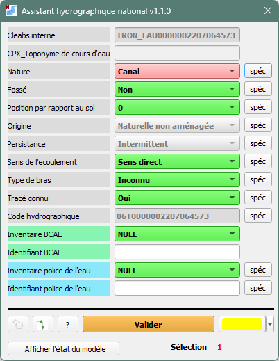 style="width:3.08956in;height:3.98877in" />

4.  Je clique sur :  pour valider les
    modifications dans QGIS.

Un message QGIS confirme la prise en compte des modifications.

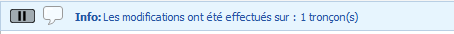

> Attention : ne pas confondre avec le bouton
> d’enregistrement du projet :  style="width:0.27087in;height:0.29171in" />
